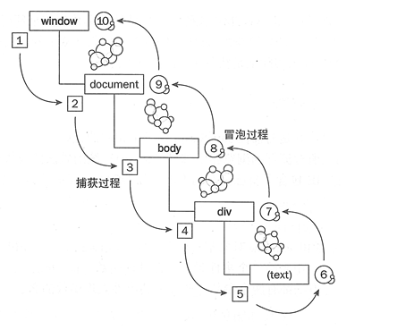

# 事件流

事件流描述的是从页面中接收事件的顺序，具体表示为事件从window开始，经过捕获和冒泡，最后回到window的过程。如图


- 事件冒泡
  事件是由最内层的元素逐渐向外层元素传递，即沿着DOM树往上传，直到传播到document对象。
- 事件捕获
  表示在事件到达预定目标之前首先捕获到，即沿着DOM树向下传。

事件冒泡和时间捕获的执行顺序：
在W3C中，事件捕获是先于事件冒泡执行的。因此事件执行时的顺序如下：
非目标元素捕获--->目标元素执行---->非目标元素冒泡

```html
<body>
	<div id="boxA">
		<div id="boxB">
			<div id="boxC"></div>
		</div>
	</div>

	<script>
		var a = document.getElementById("boxA");
		var b = document.getElementById("boxB");
		var c = document.getElementById("boxC");

		a.addEventListener("click",function(){
			console.log('a冒泡');
		}, false)
		b.addEventListener("click",function(){
			console.log('b冒泡');
		},false)
		c.addEventListener("click",function(){
			console.log('c冒泡');
		},false)
		a.addEventListener("click",function(){
			console.log('a捕获');
		}, true)
		b.addEventListener("click",function(){
			console.log('b捕获');
		},true)
		c.addEventListener("click",function(){
			console.log('C捕获');
		},true)
	</script>
</body>
```
如上dom结构，当点击boxC时，执行顺序如下：
```js
// 首先执行非目标元素的捕获
a捕获
b捕获
// 接下来执行目标元素的事件，由于进入事件队列，先进先出，所以先执行冒泡
c冒泡
C捕获
// 最后执行非目标元素的事件冒泡
b冒泡
a冒泡
```

**事件委托**
事件流的典型应用就是事件委托，事件委托就是利用了事件冒泡，将里层的事件委托给外层事件，根据event对象的属性进行事件委托，改善性能。

## 阻止冒泡和阻止默认行为
* 阻止冒泡：event.stopPropagation() / event.cancelBubble = true(兼容IE)
* 阻止默认行为：event.preventDefault() / event.returnValue = false(兼容IE)或者return false(不能阻止使用 addEventListener 绑定的事件)
* 在jQuery中，return false既可以阻止冒泡，又可以阻止默认行为
```html
<a href="www.baidu.com" id="jump">跳转</a>
<script>
var a = document.getElementById("jump");
a.addEventListener("click",function(){
	//此处不能阻止默认行为
	return false;
});
a.onclick = function(){
//此处可以阻止默认行为
  return false;
}
</script>
```

# EventLoop

js中的任务分为同步任务和异步任务，同步任务是执行在主线程，异步任务会进入一个事件队列。
事件队列中的任务又分为两种，一种是`macro-task`，叫做宏任务，一种是`micro-task`,叫做微任务。

当js主线程中的同步任务执行完毕后，会主线程优先去微任务中查看是否有可以执行的任务，之后再去处理宏任务的时间，不断的在微任务和宏任务中区读取事件，形成一个循环。
因此，同一次的事件循环中，微任务永远在宏任务之前执行。

其中属于宏任务的有:
xhr, setTimeout , setInterval
微任务有：
Promise

```js
setTimeout(function () {
    console.log(1);
});

new Promise(function(resolve,reject){
    console.log(2)
    resolve(3)
}).then(function(val){
    console.log(val);
})
// 输出为 2 3 1
```
