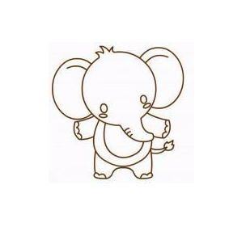
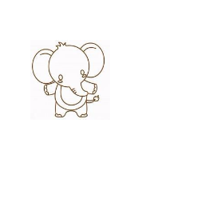

# 基本图形绘制

## 绘制矩形
* rect();没有自己独立的路径，需要配合stroke()
* strokeRect();有独立的路径，不需要显式的调用stroke()
* fillRect();有独立的路径，不需要显式的进行填充
* clearRect();清空指定的矩形区域
> 参数：x,y,width,height
```html
<canvas id="cas" style="border: 1px solid blue;" width=600 height=400></canvas>
<script>
    var cas = document.getElementById("cas");
    var ctx = cas.getContext("2d");
    ctx.rect(100,100,200,100);
    //需要调用stroke()
   	ctx.stroke();
    //有独立的路径，不需要显式的调用stroke()
	//ctx.strokeRect(100,100,200,240);
    //有独立的路径，不需要显式的进行填充
    ctx.fillRect(100,100,200,100);
    //清空指定的矩形区域
    ctx.clearRect(100,100,100,100);
</script>
```
## save和restore方法
* save()保存当前绘制的状态
* restore()恢复上次绘制的状态
  **save可以保存多次绘制状态，以栈的形式存储**
```html
<canvas id="cas" style="border: 1px solid blue;" width=600 height=400></canvas>
<script>
    var cas = document.getElementById("cas");
    var ctx = cas.getContext("2d");
    ctx.rect(100,100,200,200);
    ctx.strokeStyle = "black";
    ctx.lineWidth = 5;
    ctx.fillStyle = "orangered";
    ctx.stroke();
    ctx.fill();
    //保存上次绘制状态
    //可以保存多次，以栈格式存储，后进先出
    ctx.save();
    ctx.beginPath();
    ctx.rect(200,200,150,150);
    ctx.stroke();
    ctx.fillStyle = "yellow";
    ctx.fill();
    ctx.beginPath();
    //恢复上次绘制状态
    ctx.restore();
    ctx.rect(50,50,80,80);
    ctx.stroke();
    ctx.fill();
</script>
```
## 绘制圆弧
> arc(x,y,r,startAngle,endAngle,bool);
> 参数：圆心，半径，起始的角度，结束的角度，是否逆时针。默认是false，顺时针；true：逆时针
* 绘制简单圆弧
```html
<canvas id="cas" style="border: 1px solid blue;" width=600 height=400></canvas>
<script>
	var cas = document.getElementById("cas");
    var ctx = cas.getContext("2d");
    //绘制圆弧 arc
    //加上moveTo()会加上一条半径
    //ctx.moveTo(200,200);
    ctx.arc(200,200,100,0,-Math.PI/2);//默认是顺时针false，true表示逆时针
    ctx.stroke();
</script>
```
* 绘制带有圆角的矩形
```html
<canvas id="cas" style="border: 1px solid blue;" width=600 height=400></canvas>
<script>
    /**
     *  绘制连续的路径，如果前面的终点和后面的起点一样，就不需要重新设置moveTo()
     */
    var cas = document.getElementById("cas");
    var ctx = cas.getContext("2d");
    ctx.lineWidth = 3;
    ctx.moveTo(100,100);
    ctx.lineTo(300,100);
//在画圆弧时，上面的直线会对圆弧的绘制造成影响，所以需要从上面直线的终点开始绘制圆弧
    ctx.arc(300,120,20,-Math.PI/2,0,true);
//因为圆弧的终点与下一条直线的起始点相同，所以此处不需要moveTo()
//    ctx.moveTo(320,120);
    ctx.lineTo(320,170);
    ctx.arc(300,170,20,0,Math.PI/2,true);
//    ctx.moveTo(300,190);
    ctx.lineTo(100,190);
    ctx.arc(100,170,20,Math.PI/2,Math.PI,true);
//    ctx.moveTo(80,170);
    ctx.lineTo(80,120);
    ctx.arc(100,120,20,Math.PI,Math.PI*3/2,true);

    ctx.stroke();
</script>
```
* 封装彩虹
```html
<canvas id="cas" style="border: 1px solid blue;" width=600 height=400></canvas>
<script>
    var cas = document.getElementById("cas");
    var ctx = cas.getContext("2d");
    function Rainbow(ctx) {
        this.ctx = ctx;
    }
    Rainbow.prototype.init = function (width,rgbs) {
        var perWidth = width/6;
        this.ctx.moveTo(100,100);
        for(var i=0;i<6;i++){
            //如果不相等，则每个的进度等于后一个的值减去前一个的值除以总共变化的次数
            var r = rgbs[i+1].r==rgbs[i].r?0:(rgbs[i+1].r-rgbs[i].r)/perWidth;
            var g = rgbs[i+1].g==rgbs[i].g?0:(rgbs[i+1].g-rgbs[i].g)/perWidth;
            var b = rgbs[i+1].b==rgbs[i].b?0:(rgbs[i+1].b-rgbs[i].b)/perWidth;
            for(var j=0;j<perWidth;j++){
                //判断每个颜色两次变化是否为0，为0则取固定的值，不为零则在原来的基础上加上每次的变化值
                var color1 = r==0?rgbs[i].r:parseInt(rgbs[i].r+r*j);
                var color2 = g==0?rgbs[i].g:parseInt(rgbs[i].g+g*j);
                var color3 = b==0?rgbs[i].b:parseInt(rgbs[i].b+b*j);
                this.ctx.beginPath();
                this.ctx.strokeStyle = "rgb("+color1+","+color2+","+color3+")";
                this.ctx.moveTo(100,perWidth*i+100+j);
                this.ctx.lineTo(500,perWidth*i+100+j);
                this.ctx.stroke();
            }
        }
    };
    var rgbs = [{//红
            r:255,
            g:0,
            b:0
        },{//橙
            r:255,
            g:127,
            b:0
        },{//黄
            r:255,
            g:255,
            b:0
        },{//绿
            r:0,
            g:255,
            b:0
        },{//青
            r:0,
            g:127,
            b:255
        },{//蓝
            r:0,
            g:0,
            b:255
        },{//紫
            r:139,
            g:0,
            b:255
        }];
    var rain = new Rainbow(ctx);
    rain.init(180,rgbs);
```
## 绘制文本
* strokeText()：空心文字
* fillText():实心文字
* 文本的对齐方式
  * 水平对齐：textAlign -->  left center right start end
  * 垂直对齐：textBaseline -->  top middle bottom  
* 获取文本宽度 measureText
```html
<canvas id="cas" style="border: 1px solid blue;" width=600 height=400></canvas>
<script>
    var cas = document.getElementById("cas");
    var ctx = cas.getContext("2d");
    var str = "人生如戏";
    ctx.font="48px microsoft yahei";
    ctx.textAlign = "center";
    ctx.textBaseline = "bottom";
    
    ctx.strokeText(str,100,100);//空心文字
//    ctx.fillText(str,100,100);//实心文字
//在文字下方画一条和文本宽度相等的线
	var obj = ctx.measureText(str);
    ctx.moveTo(100,100);
    ctx.lineTo(100+obj.width,100);
    ctx.stroke();
</script> 
```
## 绘制图片
* drawImage()
* 三个参数：图片对象   放置的位置(x,y)
```html
<canvas id="cas" style="border: 1px solid blue;" width=600 height=400></canvas>
<script>
    var cas = document.getElementById("cas");
    var ctx = cas.getContext("2d");
    var img = new Image();
    img.src = "img/xiang.jpg";
    //必须等图片加载完毕后才能绘制图片
    img.onload = function () {
        ctx.drawImage(img,100,100);
    };
</script>
```
 
* 五个参数 ：图片对象，放置的位置(x,y),图片的大小(width,height)
```html
<canvas id="cas" style="border: 1px solid blue;" width=600 height=400></canvas>
<script>
    var cas = document.getElementById("cas");
    var ctx = cas.getContext("2d");
    var img = new Image();
    img.src = "img/xiang.jpg";
    //必须等图片加载完毕后才能绘制图片
    img.onload = function () {
        ctx.drawImage(img,100,100,100,100);
        //会根据设置的参数对图片进行缩放，不会把图片裁剪
    };
</script>
```
* 效果图
    
* 九个参数：图片对象，图片中的坐标，要显示的图片的宽高，放置的位置，图片的大小
   * 可以用于绘制逐帧动画,需要结合setTimeout()或者requestAnimationFrame() 
```html
<canvas id="cas" style="border: 1px solid blue;" width=600 height=400></canvas>
<script>
    var cas = document.getElementById("cas");
    var ctx = cas.getContext("2d");
    var img = new Image();
    //需要准备精灵图，让图片进行切换，实现动画效果
    img.src = "img/rabbit.png";
    var allWidth = 160;
    var allHeight = 260;
    //一共四帧
    var num = 4;
    var nowIndex = 0;
    var perHeight = allHeight/num;
    var perWidth = allWidth/num;
    img.onload = function () {
        render();
    }
    function render() {
    	//每次切换时先清空画布
        ctx.clearRect(0,0,cas.width,cas.height);
	ctx.drawImage(img,perWidth*nowIndex,0,perWidth,perHeight,cas.width/2-perWidth/2,cas.height/2-perHeight/2,perWidth,perHeight);
        nowIndex++;
        if(nowIndex==4){
            nowIndex=0;
        }
        setTimeout(render,100);
    }
</script>
```
## 变换
> 坐标轴的变换，不影响变换之前绘制的图形，但是会影响变换之后的图形
* translate(x,y):将坐标原点进行位移
* rotate(angle):以坐标原点为中心将坐标轴进行旋转（弧度）
* scale(ratex,ratey):将图形进行缩放
* 在同一个画布中绘制一个旋转的正方形和固定的正方形
```html
<canvas id="cas" style="border: 1px solid blue;" width=600 height=400></canvas>
<script>
    var cas = document.getElementById("cas");
    var ctx = cas.getContext("2d");
    var speed = Math.PI/90;
    var index = 0;
    //移动坐标原点至画布中心
    ctx.translate(cas.width/2,cas.height/2);
    function render() {
        ctx.clearRect(-cas.width/2,-cas.height/2,cas.width,cas.height);
        ctx.strokeRect(-cas.width/2,-cas.height/2,100,100);
        ctx.save();//保存的状态包括平移，旋转，缩放和基本样式设置
        ctx.rotate(speed*index);//以坐标原点为中心进行旋转
        ctx.strokeRect(-50,-50,100,100);//绘制的是旋转的矩形
        ctx.restore();//恢复固定的矩形，此时会将rotate重置为0
   //恢复状态的时候，会将重新设置绘制状态，即将rotate状态重新设置保存时的状态，即为零
   //恢复原来状态之后，旋转角度依然从零开始，所以要想达到旋转效果，必须逐渐增大角度
        index++;
        if(speed*index > 2*Math.PI){
            index = 0;
        }
        requestAnimationFrame(render);
    }
    render();
</script>
```
