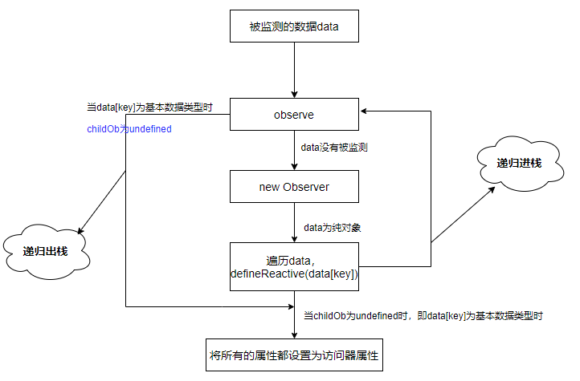
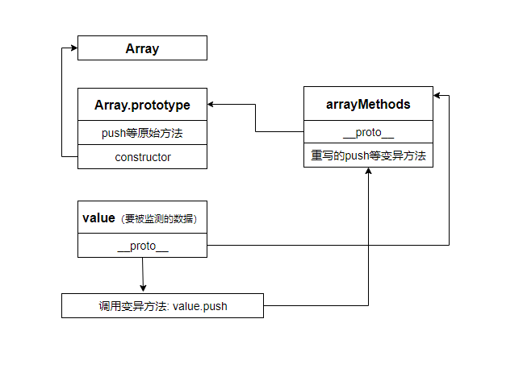

在初始化中，我们知道`data`、`props`等的初始化是在`initState`中实现的。
接下来我们先看`data`的初始化。
# 1. 遇见getter和setter
```js
// 判断data选项是否存在，存在则直接调用initData
if (opts.data) {
    initData(vm)
} else {
	// 不存在使用observe监测空对象
    observe(vm._data = {}, true /* asRootData */)
}
```

首先看`initState`做了什么:
```js
function initData (vm: Component) {
 // 首先拿到data选项的值，由选项合并那一节可知data经过mergeOptions被合并成了一个函数
  let data = vm.$options.data
  // 这里又对data类型进行了判断，是因为在initState之前会经过一个beforeCreate钩子函数，如果该钩子函数对data进行了操作，到initState时，data的类型可能会被改变
  //  同时将data选项代理到_data_上
  data = vm._data = typeof data === 'function'
    ? getData(data, vm) // data是函数，则执行getData方法，该方法的作用就是执行data函数
    : data || {}
    // 如果data不是纯对象
  if (!isPlainObject(data)) {
  // data清空，并在非生产环境下发出警告
    data = {}
    process.env.NODE_ENV !== 'production' && warn(
      'data functions should return an object:\n' +
      'https://vuejs.org/v2/guide/components.html#data-Must-Be-a-Function',
      vm
    )
  }
  // proxy data on instance
  // 获取data的键
  const keys = Object.keys(data)
  //  props选项
  const props = vm.$options.props
  // methods选项
  const methods = vm.$options.methods
  let i = keys.length
  while (i--) {                 
    const key = keys[i]
    if (process.env.NODE_ENV !== 'production') {
    //非生产环境下 methods的属性名不能和data的属性名相同，相同则发出警告
      if (methods && hasOwn(methods, key)) {
        warn(
          `Method "${key}" has already been defined as a data property.`,
          vm
        )
      }
    }
    // 如果props中含有了与data相同的key，会提醒props中已经存在了某个key，data不能使用。
    if (props && hasOwn(props, key)) {
      process.env.NODE_ENV !== 'production' && warn(
        `The data property "${key}" is already declared as a prop. ` +
        `Use prop default value instead.`,
        vm
      )
    } else if (!isReserved(key)) {// 判断该key是否是以$或者_开头
   	// 执行proxy函数
      proxy(vm, `_data`, key)
    }
  }
  // observe data  监测数据
  observe(data, true /* asRootData */)
}
```

看一下`proxy`做了什么：

```js
// 定义data的访问器属性
const sharedPropertyDefinition = {
  enumerable: true,// 可枚举
  configurable: true, // 可配置
  get: noop, // getter
  set: noop // setter
}
// data的属性已由_data代理
export function proxy (target: Object, sourceKey: string, key: string) {
	// 定义getter
  sharedPropertyDefinition.get = function proxyGetter () {
    return this[sourceKey][key] // this._data[key]
  }
   //  定义setter
  sharedPropertyDefinition.set = function proxySetter (val) {
    this[sourceKey][key] = val
  }
  // 将data选项的key赋给vm实例，定义访问器属性，因此我们可以使用  vm.属性来访问data的选项的值
  Object.defineProperty(target, key, sharedPropertyDefinition)
}
```
举个例子:
```js
var vm = new Vue({
  data: {
    tmp: 1,
  }
});
vm.tmp; // 当我们获取tmp的值时，调用的是get方法，实际上是获取的vm._data.tmp
```

我们都知道vue的数据响应根本原理是`getter`和`setter`，在此处，终于看到了庐山真面目。

总结一下在`initData`中遇到的点：
- `methods`的属性名不能与`data`的属性名相同，`data`的属性名不能与`props`的属性名相同。优先级如下: **props > data > methods**
- `data`选项的属性名不能以`$`或者`_`开头
- 在实例上添加了`_data`属性代理数据
- 通过`Object.defineProperty`将`data`选项的每个键都赋给了实例对象，成为了实例属性(有getter和setter)，因此可以通过`vm.属性`来访问`data`选项中的数据

# 2. Observe

在`initData`的最后，还有一句:
```js
observe(data, true /* asRootData */)
```
这句代码的作用就是处理数据响应的。其中有两个参数，一个是`data`选项，一个是布尔值

```js
/**
尝试为值创建观察者实例，如果成功观察则返回新观察者，如果值已经有，则返回现有观察者。
*/
export function observe (value: any, asRootData: ?boolean): Observer | void {
// 如果value不是对象，或者value是VNode的一个实例，则直接返回
  if (!isObject(value) || value instanceof VNode) {
    return
  }
  let ob: Observer | void
  // __ob__属性是用于监测数据的
  // 如果value有__ob__属性，并且该属性是Observer的实例，说明该数据已经被监测了
  if (hasOwn(value, '__ob__') && value.__ob__ instanceof Observer) {
  	// 拿到__ob__属性
    ob = value.__ob__
  } else if (
  // 否则，如果没有__ob__属性，那么该data就没有被监测过
    shouldObserve &&  // shouldObserve为true
    !isServerRendering() && //不能是服务器端渲染
    (Array.isArray(value) || isPlainObject(value)) && // value必须是数组或者纯对象
    Object.isExtensible(value) &&  // value是可扩展对象
    !value._isVue // value不能是vue实例
  ) {
   //  以上条件都成立，则创建一个新的监测对象
    ob = new Observer(value)
  }
  if (asRootData && ob) {
    ob.vmCount++
  }
  // 返回监测对象，其实就是value的__ob__属性
  return ob
}
```

上面执行了`new Observe(value)`，接下来看看`Observe`构造函数做了什么，首先看`constructor`:
```js
  //  添加实例属性
    this.value = value
    // 创建依赖对象
    this.dep = new Dep()
    this.vmCount = 0
    // def的作用是给value添加__ob__属性，值为当前实例对象，且该属性是不可枚举的
    def(value, '__ob__', this)
    // 如果value是数组
    if (Array.isArray(value)) {
    // 
      const augment = hasProto
        ? protoAugment
        : copyAugment
      augment(value, arrayMethods, arrayKeys)
      this.observeArray(value)
    } else {
    // 如果value不是数组，那么就是纯对象，执行this.walk方法
      this.walk(value)
    }
  }
```
我们知道执行`new` 时，实际执行的是`constructor`，因此经过构造函数，`data`变成了以下形式:

```js
data: {
  a: 1,
  __ob__: {
    value,
    dep,
    vmCount
  }
}
```

## 2.1 监测纯对象

从构造函数中可以看出`data`的数据类型不同时，监测的方式也是不同的
首先看纯对象的处理:
```js
  // walk方法将每个属性转换访问器属性，即存在getter和setter方法。仅当类型为Object时调用
  walk (obj: Object) {
  // 获得对象的键
    const keys = Object.keys(obj)
    // 遍历所有的键，执行defineReactive方法
    for (let i = 0; i < keys.length; i++) {
      defineReactive(obj, keys[i])
    }
  }
```

defineReactive方法：
```js
// 在上面的defineReactive传递了两个参数，obj和key
export function defineReactive (
  obj: Object,
  key: string,
  val: any,
  customSetter?: ?Function,
  shallow?: boolean
) {
// 创建一个Dep对象
  const dep = new Dep()
// 获取obj对象中key属性的特征：enumerable，configurable等
  const property = Object.getOwnPropertyDescriptor(obj, key)
  // 如果特征属性存在，并且是不可配置的，则直接返回
  if (property && property.configurable === false) {
    return
  }

  //如果property存在，将get赋给getter，否则getter是undefined
  const getter = property && property.get
  // 获取setter
  const setter = property && property.set
  // 如果getter不存在或者setter存在时，并且该函数的参数长度为2，从对象上获取val值
  if ((!getter || setter) && arguments.length === 2) {
    val = obj[key]
  }
 // 从当前例子来看，shallow每次都没有传递，因此shallow为false，则继续执行observe函数
  let childOb = !shallow && observe(val)
  // 将属性设置为访问器属性
  Object.defineProperty(obj, key, {
    enumerable: true,
    configurable: true,
    get: function reactiveGetter () {
      // ........
    },
    set: function reactiveSetter (newVal) {
      // ..........
    }
  })
}
```
简单来说，`defineReactive`方法的作用就是将数据属性变为访问器属性。
```js
 let childOb = !shallow && observe(val)
```
上面这句代码又调用了`observe`一次，目的是对`data`数据进行深度遍历并且每一项上都添加`__ob__`监测对象，直到获取到的值不是一个对象了，才会`return`,停止遍历。这样就保证了所有的属性都能被监测到。

如：
```js
data: {
  a: {
    b: 1
  }
}
```
经过监测之后变成了:
```js
data: {
  a: {
    b: 1,
    __ob__:{
    	value: a,
    	dep: new Dep(),
    	vmCount: 0
    }
  },
  __ob__: {
    value: data,
    dep: new Dep(),
    vmCount: 0
  }
}
```
**此时 `childOb = data.a.__ob__`**

**纯对象监听的思路如下图**


在上面有个判断：

```js
//  之前的判断
if (!getter && arguments.length === 2) {
    val = obj[key]
  }
// 现在的判断
 if ((!getter || setter) && arguments.length === 2) {
    val = obj[key]
  }
```
判断的情况如下:
- 1、 只要`setter`存在，即对val进行赋值
- 2、`setter`不存在，`getter`不存在时，对val进行赋值
- 3、 `setter`不存在，`getter`存在时，不对val进行赋值

在学习`defineProperty`时，我们知道当一个属性只有`getter`没有`setter`时，是可读不可写的，因此当一个属性只有`getter`没有`setter`时，我们不应对其进行监测。在之前的判断中可以看出没有对`setter`的判断，因此当情况3出现的时候，我们将不可写的数据改成了可写的数据了，这样就不能保证数据行为的统一性。

最后简单看一下`getter`和`setter`是怎么实现的:
```js
// getter
function reactiveGetter () {
	 // 获取属性的value值
      const value = getter ? getter.call(obj) : val
      // target是一个观察者对象
      if (Dep.target) {
      // depend方法用于收集依赖
        dep.depend()
        if (childOb) { // 如果有childOb存在
          childOb.dep.depend() // 子观察对象收集依赖
          if (Array.isArray(value)) {
          // 如果value是数组，那么按数组的方式收集依赖
            dependArray(value)
          }
        }
      }
      return value
    }
```

```js
// setter
function reactiveSetter (newVal) {
	 // 首先获取value值
      const value = getter ? getter.call(obj) : val
      /* eslint-disable no-self-compare */
      // 如果新值和旧值相同或者都是NaN,则不进行处理（只有NaN !== NaN）
      if (newVal === value || (newVal !== newVal && value !== value)) {
        return
      }
      /* eslint-enable no-self-compare */
      // 非生成环境下，并且customSetter存在，执行customSetter
      if (process.env.NODE_ENV !== 'production' && customSetter) {
        customSetter()
      }
      // 如果setter存在执行setter
      if (setter) {
        setter.call(obj, newVal)
      } else {
      // setter不存在则将newVal赋给val
        val = newVal
      }
      // 如果新赋的值是对象或者数据，继续添加依赖进行监测
      childOb = !shallow && observe(newVal)
      // 触发依赖
      dep.notify()
}
```

## 2.2 监测数组

在`Observer`构造函数中，对传入的数据类型分三种进行监测：
- 纯对象
- 数组
- 其他（不做处理）

我们首先要缕一下监测数组的思路：
在数组中，有一些能够改变原数组的方法，如`push`、`splice`，被称为**变异方法**，当原数组的元素增加或者改变之后，我们也需要对新增加或者改变的元素进行监测。因此在vue中，是通过拦截变异方法，对变化的元素进行监听的。

**拦截变异方法的思路:**
我们知道变异方法都是在`Array`对象的原型上的，只要在原型链查找到`Array.prototype`之前，重写变异方法，在方法中增加对新元素的监听即可。

在vue中拦截的方法有两种：
- 如果浏览器识别`__proto__`属性，扩展原型链
- 否则，在实例上添加方法

看具体实现：
```js
if (Array.isArray(value)) {
 	// 根据是否有__proto__属性，决定将augment赋值为哪种方式
      const augment = hasProto
        ? protoAugment 
        : copyAugment
      // 执行方法
      augment(value, arrayMethods, arrayKeys)
      this.observeArray(value)
    } else {
      this.walk(value)
}
```

其中`protoAugment`和`copyAugment`两个函数就是根据是否有`__proto__`属性，而进行的不同方式的变异方法拦截

```js
/**
 *通过使用__proto__拦截原型链来扩充目标对象或数组
 */
function protoAugment (target, src: Object, keys: any) {
// 根据传入的参数来看即：value.__proto__ = arrayMethods
  target.__proto__ = src
}

/**
 *通过在实例上添加属性扩充目标对象或数组。
 */
 // keys是由arrayMethods的属性组成的数组，不进行原型链的查找
function copyAugment (target: Object, src: Object, keys: Array<string>) {
  for (let i = 0, l = keys.length; i < l; i++) {
    const key = keys[i]
    def(target, key, src[key])
  }
}
```

其中`arrayMethods`是来自`array.js`的，导入的代码如下：
`import { arrayMethods } from './array'`

下面看一下`array.js`:
```js
// 获取Array的原型
const arrayProto = Array.prototype
// 以Array.prototype为原型创建一个对象
// arrayMethods.__proto === Array.prototype  可以看出arrayMethods相当于Array的一个实例
export const arrayMethods = Object.create(arrayProto)
// methodsToPatch中包含了一些数组的方法，这些方法的共同点就是都能改变原数组
const methodsToPatch = [
  'push',
  'pop',
  'shift',
  'unshift',
  'splice',
  'sort',
  'reverse'
]
/*拦截变异方法并发出事件*/
methodsToPatch.forEach(function (method) {
  // 缓存原始方法push、prop等
  const original = arrayProto[method]
 // 在arrayMethods实例对象上添加属性，属性值是一个函数，即def的第三个参数
 // 这样在查找某个属性的时候会先找到实例上的，实现了对Array.prototy的拦截
  def(arrayMethods, method, function mutator (...args) {
  	// 改变this的指向，指向该属性的调用者
  	// 将函数的返回值赋给result
    const result = original.apply(this, args)
    // 缓存监测对象
    const ob = this.__ob__
    // 保存新元素
    let inserted
    switch (method) {
      case 'push':
      case 'unshift': 
      // 上面这两个方法都是增加元素的，将新元素设置给inserted
        inserted = args
        break
      case 'splice':
      	// splice可替换元素产生新元素，第三个参数开始表示新增加的元素
        inserted = args.slice(2)
        break
    }
    // inserted有内容，则进行监测
    if (inserted) ob.observeArray(inserted)
    // notify change
    ob.dep.notify()
    return result
  })
})
```

**总结一下arrayMethods**
- `arrayMethods.__proto__ = Array.prototype`
- `arrayMethods`上添加了实例属性：变异方法，并对其进行了重写
- 重写的方法中对新添加的数据添加了监测，并触发监听，返回改变后的数组

arrayMethods与value和Array的关系如图：



拦截完了数组，接下来就是对数组进行监听：
```js
this.observeArray(value)
//......

observeArray (items: Array<any>) {
    for (let i = 0, l = items.length; i < l; i++) {
    // 递归监测数组，保证每一项数据都能监测到，直到元素不是对象为止
      observe(items[i])
    }
  }
```

`observe`方法中的第一句是：
```js
if (!isObject(value) || value instanceof VNode) {
    return
}
```
可见，如果数组中的元素为基本数据类型时，并不做任何处理，拦截数组变异主要是针对数组元素为对象或者数组的情况，如

```js
arr.push({a:1})
arr.push([1,2,3])
```

**对纯对象和数组都是通过递归操作来对数据进行深度监测的。**

**纯对象：**
逐个将对象的属性重新定义为访问器属性，并且当属性的值同样为纯对象时进行递归处理

**数组：**
通过拦截数组变异方法进行处理


