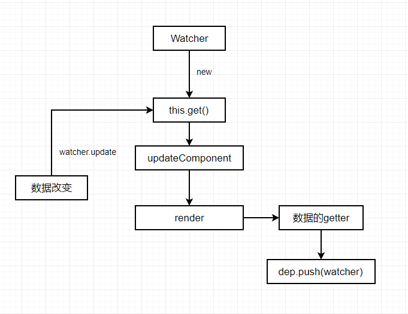

vue是使用发布者-订阅者模式，通过数据劫持实现的数据相应。上节已经了解了`Observe`即发布者，下面介绍一下订阅者。
下面先梳理一下整个响应式的流程：
observe：拦截data上每个属性的`getter`和`setter`方法，每个属性有一个`__ob__`，即`Observe`对象，每个`Observe`对象上有一个`Dep`对象，`Dep`对象维护一个数组，数组中保存的是与该`Observe`相关的`Watcher`。

# Dep

首先简单回顾一下对`getter`和`setter`的拦截处理:
```js
    get: function reactiveGetter () {
      const value = getter ? getter.call(obj) : val
      if (Dep.target) {
        dep.depend()
        // ...
      }
      return value
    },
    set: function reactiveSetter (newVal) {
      //....
      dep.notify()
    }
```
从上面可以看到对`dep`对象的调用有两次:
1、在`getter`中调用了`depend()`
2、在`setter`中调用了`notify()`

接下来就看看`Dep`是个什么鬼？

```js
export default class Dep {
 // 静态属性target，类型为Watcher  或者null和undefined
  static target: ?Watcher;
  id: number; // id标识
  subs: Array<Watcher>; // 实例属性，一个元素为Watcher的数组

  constructor () {
    this.id = uid++
    this.subs = []
  }
  // 添加依赖
  addSub (sub: Watcher) {
    this.subs.push(sub)
  }
 // 移除依赖
  removeSub (sub: Watcher) {
    remove(this.subs, sub)
  }
 // depend方法：调用了Watcher
  depend () {
  	// 当Dep.target存在时，即为Watcher
  	// 调用了Watcher的addDep方法，其实就是间接的调用了addSub
    if (Dep.target) {
      Dep.target.addDep(this)
    }
  }

  notify () {
    // stabilize the subscriber list first
    const subs = this.subs.slice() // 缓存数组
    // 遍历数组，调用update
    for (let i = 0, l = subs.length; i < l; i++) {
      subs[i].update()
    }
  }
}
```

以上就是所有的`Dep`，很简单。从中可以看出：**Dep对象连接了Observe和Watcher。**

# Watcher

在看`Watcher`之前，我们需要知道在vue实例在数据挂载之前已经实例化了`Watcher`。在`lifecycle.js`文件中的`mountComponent`函数中实现的，而对`mountComponent`的调用是在`runtime/index.js`中：
```js
Vue.prototype.$mount = function (
  el?: string | Element,
  hydrating?: boolean
): Component {
  el = el && inBrowser ? query(el) : undefined
  return mountComponent(this, el, hydrating)
}
```
`mountComponent`中的实例化：
```js
new Watcher(vm, updateComponent, noop, null, true /* isRenderWatcher */)
```
下面正式看`Watcher`:
`Watcher`也是一个类，由于代码挺长的，下面将其内部分开介绍，首先看一下构造函数
```js
constructor (
    vm: Component, // vue实例
    // 从上面的mountComponent分析，该参数为updateComponent
    expOrFn: string | Function,  
    cb: Function, // 回调函数，即数据变化后的处理函数
    options?: ?Object,
    isRenderWatcher?: boolean
  ) {
    this.vm = vm
    if (isRenderWatcher) {
      vm._watcher = this
    }
    vm._watchers.push(this)
    // options
    if (options) {
      this.deep = !!options.deep
      this.user = !!options.user
      this.lazy = !!options.lazy
      this.sync = !!options.sync
    } else {
      this.deep = this.user = this.lazy = this.sync = false
    }
    this.cb = cb
    this.id = ++uid // uid for batching
    this.active = true
    this.dirty = this.lazy // for lazy watchers
    this.deps = []
    this.newDeps = []
    this.depIds = new Set()
    this.newDepIds = new Set()
    this.expression = process.env.NODE_ENV !== 'production'
      ? expOrFn.toString()
      : ''
    // parse expression for getter
    if (typeof expOrFn === 'function') {
     // 将updateComponent赋给getter属性
      this.getter = expOrFn
    } else {
      this.getter = parsePath(expOrFn)
      if (!this.getter) {
        this.getter = function () {}
        process.env.NODE_ENV !== 'production' && warn(
          `Failed watching path: "${expOrFn}" ` +
          'Watcher only accepts simple dot-delimited paths. ' +
          'For full control, use a function instead.',
          vm
        )
      }
    }
    this.value = this.lazy
      ? undefined
      : this.get()
  }
```
我们可以看到构造函数中初始化了一些实例属性，并且直接调用了`get()`
```js
get () {
	// Dep中的全局函数，目的是将Dep.target指向当前watcher，并将watcher压栈
    pushTarget(this)
    let value
    const vm = this.vm
    try {
    // 执行getter方法，实际上是执行的vm._update,在这个函数中会对vm上的数据进行访问，此时会触发数据对象的getter拦截器，实现对数据的监听及依赖的收集
      value = this.getter.call(vm, vm)
    } catch (e) {
      if (this.user) {
        handleError(e, vm, `getter for watcher "${this.expression}"`)
      } else {
        throw e
      }
    } finally {
      // "touch" every property so they are all tracked as
      // dependencies for deep watching
      // 深度遍历数据，触发所有属性的getter
      if (this.deep) {
        traverse(value)
      }
      // 将当前的watcher对象从栈中弹出
      popTarget()
      this.cleanupDeps()
    }
    return value
  }
```
在上面介绍`Dep`对象时，在`depend`方法中调用了`watcher`的`addDep`方法，下面来看一下：
```js
 addDep (dep: Dep) {
    const id = dep.id
    // 判断当前依赖是否已经被收集，没有则收集依赖
    if (!this.newDepIds.has(id)) {
      this.newDepIds.add(id)
      this.newDeps.push(dep)
      if (!this.depIds.has(id)) {
        dep.addSub(this)
      }
    }
  }
```
上面说的都是依赖的收集处理，下面说一下触发更新, 在`Dep`的`notify`方法中，使用了`update`方法：
```js
update () {
    /* istanbul ignore else */
    if (this.lazy) {
      this.dirty = true
    } else if (this.sync) {// 如果是同步的，则直接执行run
      this.run()
    } else { // 异步时，会使用队列的方式更新
      queueWatcher(this)
    }
  }
```
**vue在更新数据时，并不是改变后就立即触发watcher，而是先把watcher添加到一个队里里， 当一个事件完成后再刷新队列，触发所有相关的watcher，执行run方法**

在不考虑队列的情况下，我们首先看一下`run`，`run`的作用就是在数据更新时，执行相关的回调函数：
```js
run () {
    if (this.active) {
      const value = this.get()
      if (
        value !== this.value ||
        // Deep watchers and watchers on Object/Arrays should fire even
        // when the value is the same, because the value may
        // have mutated.
        isObject(value) ||
        this.deep
      ) {
        // set new value
        const oldValue = this.value
        this.value = value
        if (this.user) {
          try {
          	// cb即收集到的回调函数
            this.cb.call(this.vm, value, oldValue)
          } catch (e) {
            handleError(e, this.vm, `callback for watcher "${this.expression}"`)
          }
        } else {
          this.cb.call(this.vm, value, oldValue)
        }
      }
    }
  }
```

### 异步队列更新
异步队列更新调用的是`queueWatcher`，其实最后也是调用的`run`方法来更新的，先看一下其中的过程：
```js
export const MAX_UPDATE_COUNT = 100

const queue: Array<Watcher> = []
const activatedChildren: Array<Component> = []
let has: { [key: number]: ?true } = {}
let circular: { [key: number]: number } = {}
let waiting = false
let flushing = false
let index = 0
export function queueWatcher (watcher: Watcher) {
  const id = watcher.id
  // has用来保证每个watcher对象只添加一次
  if (has[id] == null) {
    has[id] = true
    if (!flushing) {// 往队列中添加watcher对象
      queue.push(watcher)
    } else {
      // if already flushing, splice the watcher based on its id
      // if already past its id, it will be run next immediately.
      let i = queue.length - 1
      while (i > index && queue[i].id > watcher.id) {
        i--
      }
      queue.splice(i + 1, 0, watcher)
    }
    // 刷新队列，保证只刷新一次
    if (!waiting) {
      waiting = true
      nextTick(flushSchedulerQueue)
    }
  }
}
```
引入队列的作用：不会在每次数据改变的时候都触发`watcher`的回调，而是把这些`watcher`先添加到一个队列里，然后在`nextTick`时执行`flushSchedulerQueue`。

下面看一下`flushSchedulerQueue`
```js
function flushSchedulerQueue () {
  // do not cache length because more watchers might be pushed
  // as we run existing watchers
  for (index = 0; index < queue.length; index++) {
    watcher = queue[index]
    id = watcher.id
    has[id] = null
    watcher.run()
    // in dev build, check and stop circular updates.
    if (process.env.NODE_ENV !== 'production' && has[id] != null) {
      circular[id] = (circular[id] || 0) + 1
      if (circular[id] > MAX_UPDATE_COUNT) {
        warn(
          'You may have an infinite update loop ' + (
            watcher.user
              ? `in watcher with expression "${watcher.expression}"`
              : `in a component render function.`
          ),
          watcher.vm
        )
        break
      }
    }
  }

  // keep copies of post queues before resetting state
  const activatedQueue = activatedChildren.slice()
  const updatedQueue = queue.slice()

  resetSchedulerState()

  // call component updated and activated hooks
  callActivatedHooks(activatedQueue)
  callUpdatedHooks(updatedQueue)

  // devtool hook
  /* istanbul ignore if */
  if (devtools && config.devtools) {
    devtools.emit('flush')
  }
}
```

- 首先是一个排序操作：
```js
  flushing = true
  let watcher, id
  queue.sort((a, b) => a.id - b.id)
```
对`queue`进行排序，作用有以下几点：
- 1、组件的更新由父到子：因为父组件的创建过程是先于子组件的，所以`watcher`的创建也是先父后子的，执行顺序也应该保持先父后子
- 2、用户自定义的`watcher`要优先于渲染`watcher`执行：因为用户自定义的`watcher`是在渲染`watcher`之前创建的
- 3、如果一个组件在父组件的`watcher`执行期间被销毁，那么它对应的`watcher`执行都可以被跳过，所以父组件的`watcher`应该先执行

- 在队列排序完成之后，对队列进行了遍历，执行`watcher.run()`:
```js
for (index = 0; index < queue.length; index++) {
    watcher = queue[index]
    id = watcher.id
    has[id] = null
    watcher.run()
    // in dev build, check and stop circular updates.
    if (process.env.NODE_ENV !== 'production' && has[id] != null) {
      circular[id] = (circular[id] || 0) + 1
      if (circular[id] > MAX_UPDATE_COUNT) {
        warn(
          'You may have an infinite update loop ' + (
            watcher.user
              ? `in watcher with expression "${watcher.expression}"`
              : `in a component render function.`
          ),
          watcher.vm
        )
        break
      }
    }
  }
```
【注意】每次遍历的时候都要对`queue.length`进行重新计算，因为在执行`run`方法的时候，很可能会添加新的`watcher`，因此会再次执行`queueWatcher`：
```js
  const id = watcher.id
  if (has[id] == null) {
    has[id] = true
    if (!flushing) {// 这时，flushing为true，会执行else
      queue.push(watcher)
    } else {
      let i = queue.length - 1
      while (i > index && queue[i].id > watcher.id) {
        i--
      }
      // 从后往前遍历，找到合适的id位置，把watcher插入到队列中
      queue.splice(i + 1, 0, watcher)
    }
  }
```
经过以上操作，队列的长度发生了变化。

- 最后进行状态恢复`resetSchedulerState()`
```js
function resetSchedulerState () {
  index = queue.length = activatedChildren.length = 0
  has = {}
  if (process.env.NODE_ENV !== 'production') {
    circular = {}
  }
  waiting = flushing = false
}
```
主要作用就是将一些变量恢复初始值，把`watcher`队列清空。

# 总结
`Watcher`有两个作用：
- 监听数据的变化
- 在数据变化时更新视图



下面梳理一下Observe、Watcher、Dep之间的关系：
-  初始化Vue实例的过程中，数据`data`会递归的为每个属性生成一个Observer，每个Observe中又会初始化一个Dep实例
-  模板中的每个指令和数据绑定都会生成一个Watcher，实例化Watcher时，会设置Dep的静态属性target指向自身，并且手动触发getter拦截数据，从而实现依赖的收集
-  在getter中判断`Dep.target`是否存在，存在则将dep保存到watcher中，并在Dep实例中添加watcher为订阅者
-  重复以上过程直到watcher计算完成，`Dep.target`清除，依赖收集完成


